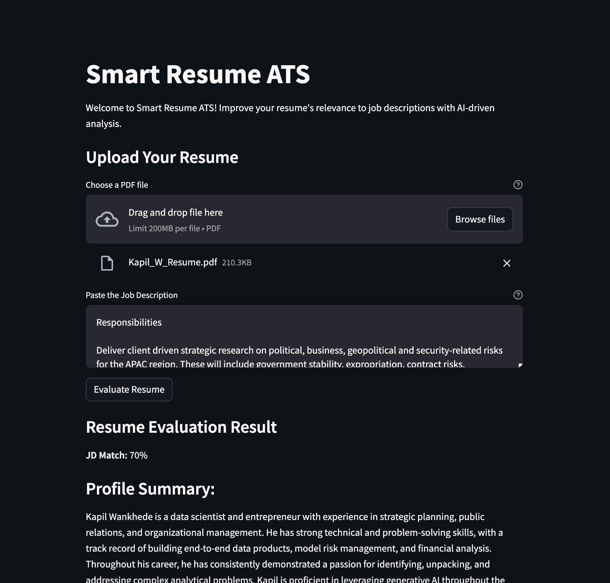

# Smart Resume ATS

This Streamlit app evaluates resumes against job descriptions using AI-driven analysis.

## About

Smart Resume ATS helps users improve their resumes' relevance to job descriptions in competitive job markets. The app uses a generative AI model to assess resumes and provide feedback on key areas such as match percentage, missing keywords, and profile summary alignment.

## Features

- Upload a resume in PDF format.
- Paste the job description for the desired position.
- Receive detailed feedback on resume relevance based on AI analysis.

## Setup

### Prerequisites

- Python 3.6+
- Pip package manager

### Installation

1. Clone the repository:

   ```bash
   git clone https://github.com/kwankhede/ATS.git
   cd ATS
   ```

2. Install dependencies:

   ```bash
   pip install -r requirements.txt
   ```

### Usage

1. Run the Streamlit app locally:

   ```bash
   streamlit run app.py
   ```

2. Access the app via your browser at `http://localhost:8501`.

### Example




## Scope for Improvement

There is always room for improvement in the Smart Resume ATS app. We encourage contributions and feedback from the community to enhance its performance and usability.

Feel free to open issues, suggest features, or contribute to the codebase to help us improve the app!


## Contributing

Contributions are welcome! For major changes, please open an issue first to discuss what you would like to change.

1. Fork the repository.
2. Create your feature branch (`git checkout -b feature/NewFeature`).
3. Commit your changes (`git commit -am 'Add some feature'`).
4. Push to the branch (`git push origin feature/NewFeature`).
5. Open a pull request.

## License

This project is licensed under the MIT License - see the [LICENSE](LICENSE) file for details.

## Acknowledgments

- [Streamlit](https://streamlit.io/) - The open-source app framework used.
- [Google Generative AI](https://cloud.google.com/ai-platform/) - AI model used for resume analysis.
- [PyPDF2](https://pythonhosted.org/PyPDF2/) - Library for PDF file operations in Python.
- [dotenv](https://github.com/theskumar/python-dotenv) - Library for loading environment variables from `.env` files.

```
